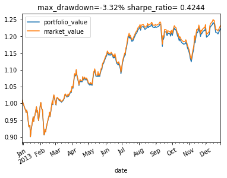
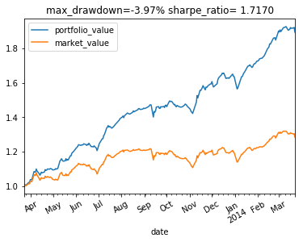
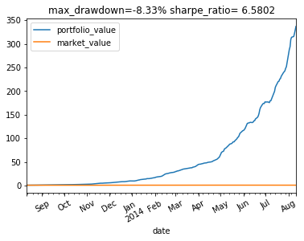
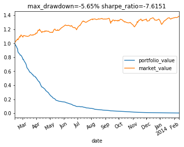
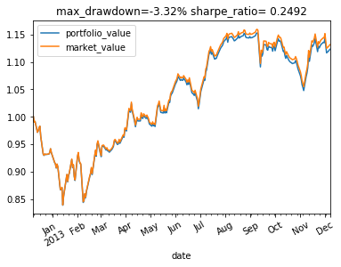
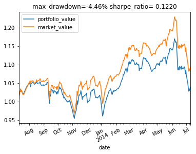
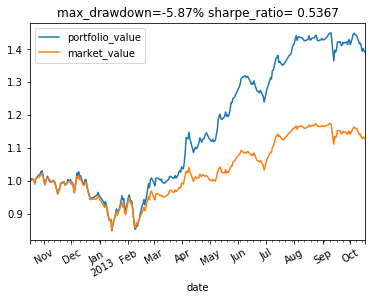
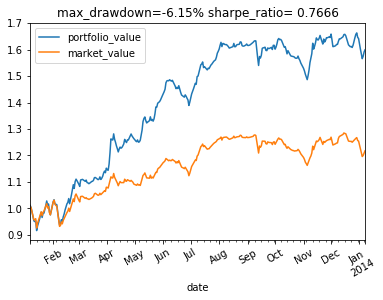

# Imitation Learning for Portfolio Management


```python
from __future__ import print_function

from utils.data import create_optimal_imitation_dataset, create_imitation_dataset, read_stock_history, normalize
import numpy as np
import random
from keras.utils.np_utils import to_categorical

from model.supervised.imitation_optimal_action import create_network_given_future,     train_optimal_action_given_future_obs,create_network_give_past, train_optimal_action_given_history_obs

%load_ext autoreload
%matplotlib inline

#%autoreload 2
```

    Using TensorFlow backend.
    


```python
# dataset
history, abbreviation = read_stock_history(filepath='utils/datasets/stocks_history_target.h5')
history = history[:, :, :4]


# 16 stocks are all involved. We choose first 3 years as training data and last 2 years as testing data.
num_training_time = 1095
target_stocks = abbreviation
target_history = np.empty(shape=(len(target_stocks), num_training_time, history.shape[2]))

for i, stock in enumerate(target_stocks):
    target_history[i] = history[abbreviation.index(stock), :num_training_time, :]

# test on 3 never seen stocks
test_stocks = abbreviation
test_history = np.empty(shape=(len(test_stocks), history.shape[1] - num_training_time, history.shape[2]))
for i, stock in enumerate(test_stocks):
    test_history[i] = history[abbreviation.index(stock), num_training_time:, :]
```

## Train optimal action given future observation

### The WINNER model


```python
# build optimal model given future model
nb_classes = len(target_stocks) + 1
optimal_given_future_model = create_network_given_future(nb_classes, True)
```

    WARNING:tensorflow:From C:\Users\Sky\Anaconda3\envs\gym36\lib\site-packages\tensorflow\python\framework\op_def_library.py:263: colocate_with (from tensorflow.python.framework.ops) is deprecated and will be removed in a future version.
    Instructions for updating:
    Colocations handled automatically by placer.
    WARNING:tensorflow:From C:\Users\Sky\Anaconda3\envs\gym36\lib\site-packages\keras\backend\tensorflow_backend.py:3445: calling dropout (from tensorflow.python.ops.nn_ops) with keep_prob is deprecated and will be removed in a future version.
    Instructions for updating:
    Please use `rate` instead of `keep_prob`. Rate should be set to `rate = 1 - keep_prob`.
    Build model from scratch
    


```python
# run this cell to train optimal action given future model
train_optimal_action_given_future_obs(optimal_given_future_model, target_history, target_stocks,True)
```

    WARNING:tensorflow:From C:\Users\Sky\Anaconda3\envs\gym36\lib\site-packages\tensorflow\python\ops\math_ops.py:3066: to_int32 (from tensorflow.python.ops.math_ops) is deprecated and will be removed in a future version.
    Instructions for updating:
    Use tf.cast instead.
    Train on 876 samples, validate on 219 samples
    Epoch 1/20
    876/876 [==============================] - 1s 603us/step - loss: 2.6014 - acc: 0.2078 - val_loss: 2.5154 - val_acc: 0.3105
    Epoch 2/20
    876/876 [==============================] - 0s 59us/step - loss: 2.0273 - acc: 0.4521 - val_loss: 2.2737 - val_acc: 0.3790
    Epoch 3/20
    876/876 [==============================] - 0s 56us/step - loss: 1.6691 - acc: 0.5422 - val_loss: 1.9700 - val_acc: 0.4247
    Epoch 4/20
    876/876 [==============================] - 0s 54us/step - loss: 1.3881 - acc: 0.6301 - val_loss: 1.6782 - val_acc: 0.5023
    Epoch 5/20
    876/876 [==============================] - 0s 55us/step - loss: 1.2135 - acc: 0.6781 - val_loss: 1.4299 - val_acc: 0.5845
    Epoch 6/20
    876/876 [==============================] - 0s 58us/step - loss: 1.0287 - acc: 0.7203 - val_loss: 1.2591 - val_acc: 0.5936
    Epoch 7/20
    876/876 [==============================] - 0s 54us/step - loss: 0.9143 - acc: 0.7466 - val_loss: 1.1312 - val_acc: 0.6347
    Epoch 8/20
    876/876 [==============================] - 0s 57us/step - loss: 0.8107 - acc: 0.7648 - val_loss: 1.0190 - val_acc: 0.6941
    Epoch 9/20
    876/876 [==============================] - 0s 56us/step - loss: 0.7250 - acc: 0.7842 - val_loss: 0.8994 - val_acc: 0.7489
    Epoch 10/20
    876/876 [==============================] - 0s 57us/step - loss: 0.6432 - acc: 0.8151 - val_loss: 0.8459 - val_acc: 0.7397
    Epoch 11/20
    876/876 [==============================] - 0s 56us/step - loss: 0.5897 - acc: 0.8242 - val_loss: 0.8253 - val_acc: 0.7397
    Epoch 12/20
    876/876 [==============================] - 0s 58us/step - loss: 0.5539 - acc: 0.8390 - val_loss: 0.7796 - val_acc: 0.7580
    Epoch 13/20
    876/876 [==============================] - 0s 61us/step - loss: 0.5248 - acc: 0.8447 - val_loss: 0.7312 - val_acc: 0.7945
    Epoch 14/20
    876/876 [==============================] - 0s 58us/step - loss: 0.4833 - acc: 0.8584 - val_loss: 0.6956 - val_acc: 0.7945
    Epoch 15/20
    876/876 [==============================] - 0s 59us/step - loss: 0.4545 - acc: 0.8664 - val_loss: 0.6577 - val_acc: 0.8265
    Epoch 16/20
    876/876 [==============================] - 0s 58us/step - loss: 0.4509 - acc: 0.8470 - val_loss: 0.6780 - val_acc: 0.7900
    Epoch 17/20
    876/876 [==============================] - 0s 52us/step - loss: 0.4132 - acc: 0.8756 - val_loss: 0.6704 - val_acc: 0.8082
    Epoch 18/20
    876/876 [==============================] - 0s 54us/step - loss: 0.4072 - acc: 0.8813 - val_loss: 0.6493 - val_acc: 0.7900
    Epoch 19/20
    876/876 [==============================] - 0s 52us/step - loss: 0.3834 - acc: 0.8744 - val_loss: 0.6195 - val_acc: 0.8265
    Epoch 20/20
    876/876 [==============================] - 0s 55us/step - loss: 0.3643 - acc: 0.8767 - val_loss: 0.6395 - val_acc: 0.8082
    Type True to save weights
    True
    True to continue train, otherwise stop
    
    

### The LOSER model


```python
# build optimal model given future model
loser_given_future_model = create_network_given_future(nb_classes,False)
```

    Build model from scratch
    


```python
# run this cell to train optimal action given future model
train_optimal_action_given_future_obs(loser_given_future_model, target_history, target_stocks, False)
```

    Train on 876 samples, validate on 219 samples
    Epoch 1/20
    876/876 [==============================] - 1s 604us/step - loss: 2.5860 - acc: 0.2089 - val_loss: 2.5909 - val_acc: 0.2146
    Epoch 2/20
    876/876 [==============================] - 0s 55us/step - loss: 2.1128 - acc: 0.3699 - val_loss: 2.3755 - val_acc: 0.2968
    Epoch 3/20
    876/876 [==============================] - 0s 55us/step - loss: 1.7890 - acc: 0.5000 - val_loss: 2.1209 - val_acc: 0.4110
    Epoch 4/20
    876/876 [==============================] - 0s 56us/step - loss: 1.5367 - acc: 0.5788 - val_loss: 1.9190 - val_acc: 0.4566
    Epoch 5/20
    876/876 [==============================] - 0s 56us/step - loss: 1.3371 - acc: 0.6084 - val_loss: 1.7254 - val_acc: 0.5068
    Epoch 6/20
    876/876 [==============================] - 0s 56us/step - loss: 1.1401 - acc: 0.6747 - val_loss: 1.5480 - val_acc: 0.5114
    Epoch 7/20
    876/876 [==============================] - 0s 57us/step - loss: 1.0416 - acc: 0.6838 - val_loss: 1.4554 - val_acc: 0.5342
    Epoch 8/20
    876/876 [==============================] - 0s 56us/step - loss: 0.9178 - acc: 0.7283 - val_loss: 1.3744 - val_acc: 0.5297
    Epoch 9/20
    876/876 [==============================] - 0s 55us/step - loss: 0.8368 - acc: 0.7511 - val_loss: 1.2907 - val_acc: 0.5479
    Epoch 10/20
    876/876 [==============================] - 0s 56us/step - loss: 0.7661 - acc: 0.7763 - val_loss: 1.2151 - val_acc: 0.5571
    Epoch 11/20
    876/876 [==============================] - 0s 57us/step - loss: 0.7102 - acc: 0.7968 - val_loss: 1.1839 - val_acc: 0.5708
    Epoch 12/20
    876/876 [==============================] - 0s 55us/step - loss: 0.6546 - acc: 0.7957 - val_loss: 1.1190 - val_acc: 0.5890
    Epoch 13/20
    876/876 [==============================] - 0s 55us/step - loss: 0.6351 - acc: 0.8094 - val_loss: 1.1020 - val_acc: 0.5982
    Epoch 14/20
    876/876 [==============================] - 0s 61us/step - loss: 0.5934 - acc: 0.8139 - val_loss: 1.0834 - val_acc: 0.6256
    Epoch 15/20
    876/876 [==============================] - 0s 56us/step - loss: 0.5607 - acc: 0.8311 - val_loss: 1.0865 - val_acc: 0.6073
    Epoch 16/20
    876/876 [==============================] - 0s 57us/step - loss: 0.5240 - acc: 0.8505 - val_loss: 1.0642 - val_acc: 0.5890
    Epoch 17/20
    876/876 [==============================] - 0s 55us/step - loss: 0.4975 - acc: 0.8470 - val_loss: 1.0149 - val_acc: 0.6438
    Epoch 18/20
    876/876 [==============================] - 0s 54us/step - loss: 0.4479 - acc: 0.8676 - val_loss: 1.0032 - val_acc: 0.6438
    Epoch 19/20
    876/876 [==============================] - 0s 56us/step - loss: 0.4802 - acc: 0.8493 - val_loss: 0.9901 - val_acc: 0.6575
    Epoch 20/20
    876/876 [==============================] - 0s 55us/step - loss: 0.4312 - acc: 0.8642 - val_loss: 1.0276 - val_acc: 0.6119
    Type True to save weights
    True
    True to continue train, otherwise stop
    
    

## Test learning from optimal action using future data: sanity check

### The WINNER model


```python
(X_test, y_test), (_, _) = create_optimal_imitation_dataset(test_history, True)

Y_test = to_categorical(y_test, nb_classes)
loss, acc = optimal_given_future_model.evaluate(X_test, Y_test)
print('Testing result: loss - {}, accuracy - {}'.format(loss, acc))
```

    584/584 [==============================] - 0s 38us/step
    Testing result: loss - 0.8146826518725042, accuracy - 0.714041095890411
    

### The LOSER model


```python
(X_test1, y_test1), (_, _) = create_optimal_imitation_dataset(test_history, False)
Y_test1 = to_categorical(y_test1, nb_classes)
loss1, acc1 = loser_given_future_model.evaluate(X_test1, Y_test1)
print('Testing result: loss - {}, accuracy - {}'.format(loss, acc))
```

    584/584 [==============================] - 0s 38us/step
    Testing result: loss - 0.8146826518725042, accuracy - 0.714041095890411
    

### Start to play in an environment with stocks we have never seen before


```python
from environment.portfolio import PortfolioEnv
env = PortfolioEnv(test_history, test_stocks, steps=365)
```

### The WINNER model


```python
# buy and sell only 1 stock
done = False
observation, info = env.reset()
ground_truth_obs = info['next_obs']
close_open_ratio = np.transpose(ground_truth_obs[:, :, 3] / ground_truth_obs[:, :, 0])
close_open_ratio = normalize(close_open_ratio)
while not done:
    action = np.ones((nb_classes,))
    current_action_index = optimal_given_future_model.predict_classes(close_open_ratio, verbose=False)
    action[current_action_index] = nb_classes -1
    observation, reward, done, info = env.step(action)
    ground_truth_obs = info['next_obs']
    close_open_ratio = np.transpose(ground_truth_obs[:, :, 3] / ground_truth_obs[:, :, 0])
    close_open_ratio = normalize(close_open_ratio)
env.render()
```


    <Figure size 432x288 with 0 Axes>





### The LOSER model


```python
# buy and sell only 1 stock
done = False
observation, info = env.reset()
ground_truth_obs = info['next_obs']
close_open_ratio = np.transpose(ground_truth_obs[:, :, 3] / ground_truth_obs[:, :, 0])
close_open_ratio = normalize(close_open_ratio)
while not done:
    action = np.ones((nb_classes,)) # instead of zeros
    current_action_index = loser_given_future_model.predict_classes(close_open_ratio, verbose=False)
    action[current_action_index] = 0 # instead of 1.0
    observation, reward, done, info = env.step(action)
    ground_truth_obs = info['next_obs']
    close_open_ratio = np.transpose(ground_truth_obs[:, :, 3] / ground_truth_obs[:, :, 0])
    close_open_ratio = normalize(close_open_ratio)
env.render()
```


    <Figure size 432x288 with 0 Axes>





### It turns out that using probability distribution sometimes yield higher return

### The WINNER model


```python
# buy and sell according to the probability, not the label
done = False
observation, info = env.reset()
ground_truth_obs = info['next_obs']
close_open_ratio = np.transpose(ground_truth_obs[:, :, 3] / ground_truth_obs[:, :, 0])
close_open_ratio = normalize(close_open_ratio)
printed=0
while not done:
    current_action = optimal_given_future_model.predict(close_open_ratio, verbose=False)
  
    current_action = np.squeeze(current_action, axis=0)
        
    observation, reward, done, info = env.step(current_action)
    ground_truth_obs = info['next_obs']
    close_open_ratio = np.transpose(ground_truth_obs[:, :, 3] / ground_truth_obs[:, :, 0])
    close_open_ratio = normalize(close_open_ratio)
env.render()
```


    <Figure size 432x288 with 0 Axes>





### The LOSER model


```python
# buy and sell according to the probability, not the label
done = False
observation, info = env.reset()
ground_truth_obs = info['next_obs']
close_open_ratio = np.transpose(ground_truth_obs[:, :, 3] / ground_truth_obs[:, :, 0])
close_open_ratio = normalize(close_open_ratio)
printed=0
while not done:
    current_action = loser_given_future_model.predict(close_open_ratio, verbose=False)
    
    current_action = np.squeeze(current_action, axis=0)
        
    observation, reward, done, info = env.step(current_action)
    ground_truth_obs = info['next_obs']
    close_open_ratio = np.transpose(ground_truth_obs[:, :, 3] / ground_truth_obs[:, :, 0])
    close_open_ratio = normalize(close_open_ratio)
env.render()
```


    <Figure size 432x288 with 0 Axes>





## Train optimal action given history observation

### The WINNER model


```python
# we need to test different window length
window_length = 3
# create model
optimal_given_past_model = create_network_give_past(nb_classes, window_length,True)
```

    Build model from scratch
    


```python
# run this cell to train the model. 
# For 3 stocks, it would take 200 epoches to converge to around 45% validation accuracy
# For 16 stocks, the validation accuracy is around 15%.
train_optimal_action_given_history_obs(optimal_given_past_model, target_history, target_stocks, window_length,True )
```

    Train on 876 samples, validate on 216 samples
    Epoch 1/100
    876/876 [==============================] - 1s 1ms/step - loss: 2.8908 - acc: 0.0833 - val_loss: 2.8220 - val_acc: 0.1157
    Epoch 2/100
    876/876 [==============================] - 0s 74us/step - loss: 2.8077 - acc: 0.1119 - val_loss: 2.8156 - val_acc: 0.1065
    Epoch 3/100
    876/876 [==============================] - 0s 71us/step - loss: 2.7667 - acc: 0.1267 - val_loss: 2.8121 - val_acc: 0.1111
    Epoch 4/100
    876/876 [==============================] - 0s 68us/step - loss: 2.7662 - acc: 0.1027 - val_loss: 2.8091 - val_acc: 0.1065
    Epoch 5/100
    876/876 [==============================] - 0s 66us/step - loss: 2.7577 - acc: 0.1233 - val_loss: 2.8065 - val_acc: 0.1065
    Epoch 6/100
    876/876 [==============================] - 0s 65us/step - loss: 2.7355 - acc: 0.1233 - val_loss: 2.8053 - val_acc: 0.1111
    Epoch 7/100
    876/876 [==============================] - 0s 65us/step - loss: 2.7207 - acc: 0.1153 - val_loss: 2.8037 - val_acc: 0.1204
    Epoch 8/100
    876/876 [==============================] - 0s 64us/step - loss: 2.6913 - acc: 0.1233 - val_loss: 2.8031 - val_acc: 0.1019
    Epoch 9/100
    876/876 [==============================] - 0s 64us/step - loss: 2.6851 - acc: 0.1210 - val_loss: 2.8045 - val_acc: 0.0972
    Epoch 10/100
    876/876 [==============================] - 0s 66us/step - loss: 2.7040 - acc: 0.1005 - val_loss: 2.8052 - val_acc: 0.0972
    Epoch 11/100
    876/876 [==============================] - 0s 65us/step - loss: 2.6852 - acc: 0.1370 - val_loss: 2.8016 - val_acc: 0.1019
    Epoch 12/100
    876/876 [==============================] - 0s 63us/step - loss: 2.6818 - acc: 0.1301 - val_loss: 2.7994 - val_acc: 0.1111
    Epoch 13/100
    876/876 [==============================] - 0s 66us/step - loss: 2.6668 - acc: 0.1176 - val_loss: 2.7976 - val_acc: 0.1111
    Epoch 14/100
    876/876 [==============================] - 0s 64us/step - loss: 2.6641 - acc: 0.1553 - val_loss: 2.7972 - val_acc: 0.1296
    Epoch 15/100
    876/876 [==============================] - 0s 67us/step - loss: 2.6492 - acc: 0.1381 - val_loss: 2.7970 - val_acc: 0.1389
    Epoch 16/100
    876/876 [==============================] - 0s 65us/step - loss: 2.6698 - acc: 0.1267 - val_loss: 2.7970 - val_acc: 0.1296
    Epoch 17/100
    876/876 [==============================] - 0s 66us/step - loss: 2.6494 - acc: 0.1279 - val_loss: 2.7978 - val_acc: 0.1204
    Epoch 18/100
    876/876 [==============================] - 0s 65us/step - loss: 2.6461 - acc: 0.1484 - val_loss: 2.7979 - val_acc: 0.1204
    Epoch 19/100
    876/876 [==============================] - 0s 73us/step - loss: 2.6508 - acc: 0.1427 - val_loss: 2.7972 - val_acc: 0.1250
    Epoch 20/100
    876/876 [==============================] - 0s 65us/step - loss: 2.6327 - acc: 0.1393 - val_loss: 2.7949 - val_acc: 0.1296
    Epoch 21/100
    876/876 [==============================] - 0s 65us/step - loss: 2.6341 - acc: 0.1564 - val_loss: 2.7923 - val_acc: 0.1204
    Epoch 22/100
    876/876 [==============================] - 0s 67us/step - loss: 2.6358 - acc: 0.1495 - val_loss: 2.7908 - val_acc: 0.1157
    Epoch 23/100
    876/876 [==============================] - 0s 67us/step - loss: 2.6353 - acc: 0.1450 - val_loss: 2.7905 - val_acc: 0.1204
    Epoch 24/100
    876/876 [==============================] - 0s 66us/step - loss: 2.6057 - acc: 0.1575 - val_loss: 2.7911 - val_acc: 0.1157
    Epoch 25/100
    876/876 [==============================] - 0s 66us/step - loss: 2.6119 - acc: 0.1541 - val_loss: 2.7906 - val_acc: 0.1065
    Epoch 26/100
    876/876 [==============================] - 0s 66us/step - loss: 2.6090 - acc: 0.1518 - val_loss: 2.7918 - val_acc: 0.1111
    Epoch 27/100
    876/876 [==============================] - 0s 67us/step - loss: 2.6130 - acc: 0.1701 - val_loss: 2.7912 - val_acc: 0.1111
    Epoch 28/100
    876/876 [==============================] - 0s 66us/step - loss: 2.5770 - acc: 0.1553 - val_loss: 2.7928 - val_acc: 0.1204
    Epoch 29/100
    876/876 [==============================] - 0s 66us/step - loss: 2.6173 - acc: 0.1735 - val_loss: 2.7927 - val_acc: 0.1250
    Epoch 30/100
    876/876 [==============================] - 0s 65us/step - loss: 2.6127 - acc: 0.1678 - val_loss: 2.7919 - val_acc: 0.1250
    Epoch 31/100
    876/876 [==============================] - 0s 65us/step - loss: 2.6085 - acc: 0.1712 - val_loss: 2.7911 - val_acc: 0.1296
    Epoch 32/100
    876/876 [==============================] - 0s 67us/step - loss: 2.5891 - acc: 0.1518 - val_loss: 2.7919 - val_acc: 0.1343
    Epoch 33/100
    876/876 [==============================] - 0s 65us/step - loss: 2.5877 - acc: 0.1712 - val_loss: 2.7913 - val_acc: 0.1250
    Epoch 34/100
    876/876 [==============================] - 0s 66us/step - loss: 2.6045 - acc: 0.1610 - val_loss: 2.7891 - val_acc: 0.1343
    Epoch 35/100
    876/876 [==============================] - 0s 67us/step - loss: 2.5842 - acc: 0.1678 - val_loss: 2.7870 - val_acc: 0.1389
    Epoch 36/100
    876/876 [==============================] - 0s 67us/step - loss: 2.5889 - acc: 0.1769 - val_loss: 2.7854 - val_acc: 0.1343
    Epoch 37/100
    876/876 [==============================] - 0s 66us/step - loss: 2.6023 - acc: 0.1518 - val_loss: 2.7852 - val_acc: 0.1296
    Epoch 38/100
    876/876 [==============================] - 0s 72us/step - loss: 2.5753 - acc: 0.1747 - val_loss: 2.7849 - val_acc: 0.1296
    Epoch 39/100
    876/876 [==============================] - 0s 65us/step - loss: 2.5860 - acc: 0.1610 - val_loss: 2.7855 - val_acc: 0.1250
    Epoch 40/100
    876/876 [==============================] - 0s 67us/step - loss: 2.5953 - acc: 0.1667 - val_loss: 2.7855 - val_acc: 0.1343
    Epoch 41/100
    876/876 [==============================] - 0s 66us/step - loss: 2.5789 - acc: 0.1769 - val_loss: 2.7840 - val_acc: 0.1343
    Epoch 42/100
    876/876 [==============================] - 0s 68us/step - loss: 2.5845 - acc: 0.1735 - val_loss: 2.7841 - val_acc: 0.1204
    Epoch 43/100
    876/876 [==============================] - 0s 67us/step - loss: 2.5761 - acc: 0.1610 - val_loss: 2.7840 - val_acc: 0.1250
    Epoch 44/100
    876/876 [==============================] - 0s 65us/step - loss: 2.5680 - acc: 0.1610 - val_loss: 2.7845 - val_acc: 0.1111
    Epoch 45/100
    876/876 [==============================] - 0s 66us/step - loss: 2.5757 - acc: 0.1735 - val_loss: 2.7855 - val_acc: 0.1204
    Epoch 46/100
    876/876 [==============================] - 0s 67us/step - loss: 2.5683 - acc: 0.1838 - val_loss: 2.7864 - val_acc: 0.1250
    Epoch 47/100
    876/876 [==============================] - 0s 67us/step - loss: 2.5499 - acc: 0.1861 - val_loss: 2.7874 - val_acc: 0.1111
    Epoch 48/100
    876/876 [==============================] - 0s 66us/step - loss: 2.5562 - acc: 0.2021 - val_loss: 2.7876 - val_acc: 0.1111
    Epoch 49/100
    876/876 [==============================] - 0s 66us/step - loss: 2.5686 - acc: 0.1781 - val_loss: 2.7854 - val_acc: 0.1111
    Epoch 50/100
    876/876 [==============================] - 0s 66us/step - loss: 2.5462 - acc: 0.1952 - val_loss: 2.7838 - val_acc: 0.1111
    Epoch 51/100
    876/876 [==============================] - 0s 67us/step - loss: 2.5731 - acc: 0.1769 - val_loss: 2.7830 - val_acc: 0.1157
    Epoch 52/100
    876/876 [==============================] - 0s 66us/step - loss: 2.5525 - acc: 0.1724 - val_loss: 2.7805 - val_acc: 0.1111
    Epoch 53/100
    876/876 [==============================] - 0s 67us/step - loss: 2.5682 - acc: 0.1895 - val_loss: 2.7792 - val_acc: 0.1157
    Epoch 54/100
    876/876 [==============================] - 0s 66us/step - loss: 2.5452 - acc: 0.1701 - val_loss: 2.7781 - val_acc: 0.1111
    Epoch 55/100
    876/876 [==============================] - 0s 67us/step - loss: 2.5547 - acc: 0.1998 - val_loss: 2.7787 - val_acc: 0.1065
    Epoch 56/100
    876/876 [==============================] - 0s 67us/step - loss: 2.5513 - acc: 0.1758 - val_loss: 2.7791 - val_acc: 0.1065
    Epoch 57/100
    876/876 [==============================] - 0s 67us/step - loss: 2.5504 - acc: 0.1872 - val_loss: 2.7790 - val_acc: 0.1157
    Epoch 58/100
    876/876 [==============================] - 0s 71us/step - loss: 2.5477 - acc: 0.1941 - val_loss: 2.7789 - val_acc: 0.1065
    Epoch 59/100
    876/876 [==============================] - 0s 69us/step - loss: 2.5545 - acc: 0.1941 - val_loss: 2.7780 - val_acc: 0.1065
    Epoch 60/100
    876/876 [==============================] - 0s 68us/step - loss: 2.5279 - acc: 0.2100 - val_loss: 2.7760 - val_acc: 0.1019
    Epoch 61/100
    876/876 [==============================] - 0s 66us/step - loss: 2.5473 - acc: 0.1884 - val_loss: 2.7750 - val_acc: 0.1157
    Epoch 62/100
    876/876 [==============================] - 0s 68us/step - loss: 2.5376 - acc: 0.1781 - val_loss: 2.7749 - val_acc: 0.1250
    Epoch 63/100
    876/876 [==============================] - 0s 67us/step - loss: 2.5344 - acc: 0.1826 - val_loss: 2.7755 - val_acc: 0.1111
    Epoch 64/100
    876/876 [==============================] - 0s 66us/step - loss: 2.5478 - acc: 0.1986 - val_loss: 2.7757 - val_acc: 0.1157
    Epoch 65/100
    876/876 [==============================] - 0s 68us/step - loss: 2.5294 - acc: 0.1906 - val_loss: 2.7760 - val_acc: 0.1204
    Epoch 66/100
    876/876 [==============================] - 0s 66us/step - loss: 2.5070 - acc: 0.2078 - val_loss: 2.7766 - val_acc: 0.1204
    Epoch 67/100
    876/876 [==============================] - 0s 68us/step - loss: 2.5091 - acc: 0.2169 - val_loss: 2.7766 - val_acc: 0.1157
    Epoch 68/100
    876/876 [==============================] - 0s 67us/step - loss: 2.5313 - acc: 0.1929 - val_loss: 2.7740 - val_acc: 0.1204
    Epoch 69/100
    876/876 [==============================] - 0s 66us/step - loss: 2.5225 - acc: 0.2158 - val_loss: 2.7723 - val_acc: 0.1157
    Epoch 70/100
    876/876 [==============================] - 0s 67us/step - loss: 2.5355 - acc: 0.1963 - val_loss: 2.7709 - val_acc: 0.1157
    Epoch 71/100
    876/876 [==============================] - 0s 67us/step - loss: 2.5254 - acc: 0.2078 - val_loss: 2.7698 - val_acc: 0.1204
    Epoch 72/100
    876/876 [==============================] - 0s 68us/step - loss: 2.4962 - acc: 0.2066 - val_loss: 2.7701 - val_acc: 0.1204
    Epoch 73/100
    876/876 [==============================] - 0s 69us/step - loss: 2.5116 - acc: 0.2169 - val_loss: 2.7707 - val_acc: 0.1157
    Epoch 74/100
    876/876 [==============================] - 0s 68us/step - loss: 2.5247 - acc: 0.2066 - val_loss: 2.7707 - val_acc: 0.1157
    Epoch 75/100
    876/876 [==============================] - 0s 68us/step - loss: 2.5190 - acc: 0.2043 - val_loss: 2.7694 - val_acc: 0.1111
    Epoch 76/100
    876/876 [==============================] - 0s 67us/step - loss: 2.4880 - acc: 0.2032 - val_loss: 2.7691 - val_acc: 0.1111
    Epoch 77/100
    876/876 [==============================] - 0s 69us/step - loss: 2.4951 - acc: 0.2123 - val_loss: 2.7703 - val_acc: 0.1204
    Epoch 78/100
    876/876 [==============================] - 0s 68us/step - loss: 2.4786 - acc: 0.2329 - val_loss: 2.7704 - val_acc: 0.1204
    Epoch 79/100
    876/876 [==============================] - 0s 67us/step - loss: 2.5041 - acc: 0.2055 - val_loss: 2.7699 - val_acc: 0.1204
    Epoch 80/100
    876/876 [==============================] - 0s 69us/step - loss: 2.4877 - acc: 0.2135 - val_loss: 2.7692 - val_acc: 0.1065
    Epoch 81/100
    876/876 [==============================] - 0s 72us/step - loss: 2.5049 - acc: 0.2283 - val_loss: 2.7699 - val_acc: 0.1019
    Epoch 82/100
    876/876 [==============================] - 0s 67us/step - loss: 2.5106 - acc: 0.2066 - val_loss: 2.7707 - val_acc: 0.1019
    Epoch 83/100
    876/876 [==============================] - 0s 68us/step - loss: 2.4842 - acc: 0.2089 - val_loss: 2.7699 - val_acc: 0.1019
    Epoch 84/100
    876/876 [==============================] - 0s 69us/step - loss: 2.4901 - acc: 0.2078 - val_loss: 2.7698 - val_acc: 0.1065
    Epoch 85/100
    876/876 [==============================] - 0s 68us/step - loss: 2.4713 - acc: 0.1918 - val_loss: 2.7694 - val_acc: 0.1157
    Epoch 86/100
    876/876 [==============================] - 0s 68us/step - loss: 2.4692 - acc: 0.2100 - val_loss: 2.7681 - val_acc: 0.1296
    Epoch 87/100
    876/876 [==============================] - 0s 68us/step - loss: 2.4722 - acc: 0.2432 - val_loss: 2.7669 - val_acc: 0.1204
    Epoch 88/100
    876/876 [==============================] - 0s 69us/step - loss: 2.4892 - acc: 0.2226 - val_loss: 2.7643 - val_acc: 0.1250
    Epoch 89/100
    876/876 [==============================] - 0s 69us/step - loss: 2.4732 - acc: 0.2386 - val_loss: 2.7624 - val_acc: 0.1250
    Epoch 90/100
    876/876 [==============================] - 0s 68us/step - loss: 2.4594 - acc: 0.2237 - val_loss: 2.7625 - val_acc: 0.1204
    Epoch 91/100
    876/876 [==============================] - 0s 68us/step - loss: 2.4492 - acc: 0.2237 - val_loss: 2.7652 - val_acc: 0.1204
    Epoch 92/100
    876/876 [==============================] - 0s 68us/step - loss: 2.4509 - acc: 0.2249 - val_loss: 2.7657 - val_acc: 0.1157
    Epoch 93/100
    876/876 [==============================] - 0s 68us/step - loss: 2.4608 - acc: 0.2249 - val_loss: 2.7639 - val_acc: 0.1157
    Epoch 94/100
    876/876 [==============================] - 0s 68us/step - loss: 2.4675 - acc: 0.2374 - val_loss: 2.7632 - val_acc: 0.1204
    Epoch 95/100
    876/876 [==============================] - 0s 69us/step - loss: 2.4662 - acc: 0.2226 - val_loss: 2.7623 - val_acc: 0.1250
    Epoch 96/100
    876/876 [==============================] - 0s 67us/step - loss: 2.4648 - acc: 0.2272 - val_loss: 2.7613 - val_acc: 0.1250
    Epoch 97/100
    876/876 [==============================] - 0s 68us/step - loss: 2.4123 - acc: 0.2477 - val_loss: 2.7606 - val_acc: 0.1250
    Epoch 98/100
    876/876 [==============================] - 0s 69us/step - loss: 2.4536 - acc: 0.2352 - val_loss: 2.7593 - val_acc: 0.1343
    Epoch 99/100
    876/876 [==============================] - 0s 71us/step - loss: 2.4807 - acc: 0.2409 - val_loss: 2.7577 - val_acc: 0.1389
    Epoch 100/100
    876/876 [==============================] - 0s 69us/step - loss: 2.4612 - acc: 0.2306 - val_loss: 2.7579 - val_acc: 0.1435
    Type True to save weights
    True
    True to continue train, otherwise stop training...
    
    

### The LOSER model


```python
# create model
loser_given_past_model = create_network_give_past(nb_classes, window_length,False)
```

    Build model from scratch
    


```python
train_optimal_action_given_history_obs(loser_given_past_model, target_history, target_stocks, window_length,False)
```

    Train on 876 samples, validate on 216 samples
    Epoch 1/100
    876/876 [==============================] - 1s 1ms/step - loss: 2.8780 - acc: 0.0822 - val_loss: 2.8223 - val_acc: 0.0787
    Epoch 2/100
    876/876 [==============================] - 0s 67us/step - loss: 2.8367 - acc: 0.0685 - val_loss: 2.8176 - val_acc: 0.0741
    Epoch 3/100
    876/876 [==============================] - 0s 69us/step - loss: 2.7805 - acc: 0.0936 - val_loss: 2.8146 - val_acc: 0.0787
    Epoch 4/100
    876/876 [==============================] - 0s 66us/step - loss: 2.7492 - acc: 0.1107 - val_loss: 2.8113 - val_acc: 0.0833
    Epoch 5/100
    876/876 [==============================] - 0s 68us/step - loss: 2.7403 - acc: 0.1096 - val_loss: 2.8092 - val_acc: 0.0833
    Epoch 6/100
    876/876 [==============================] - 0s 67us/step - loss: 2.7289 - acc: 0.1073 - val_loss: 2.8073 - val_acc: 0.0741
    Epoch 7/100
    876/876 [==============================] - 0s 71us/step - loss: 2.7121 - acc: 0.1279 - val_loss: 2.8051 - val_acc: 0.0833
    Epoch 8/100
    876/876 [==============================] - 0s 69us/step - loss: 2.7013 - acc: 0.1358 - val_loss: 2.8038 - val_acc: 0.0833
    Epoch 9/100
    876/876 [==============================] - 0s 67us/step - loss: 2.6999 - acc: 0.1142 - val_loss: 2.8032 - val_acc: 0.0880
    Epoch 10/100
    876/876 [==============================] - 0s 68us/step - loss: 2.6669 - acc: 0.1461 - val_loss: 2.8017 - val_acc: 0.1019
    Epoch 11/100
    876/876 [==============================] - 0s 72us/step - loss: 2.6857 - acc: 0.1495 - val_loss: 2.8009 - val_acc: 0.1019
    Epoch 12/100
    876/876 [==============================] - 0s 67us/step - loss: 2.6591 - acc: 0.1404 - val_loss: 2.8012 - val_acc: 0.0880
    Epoch 13/100
    876/876 [==============================] - 0s 68us/step - loss: 2.6301 - acc: 0.1518 - val_loss: 2.8020 - val_acc: 0.0787
    Epoch 14/100
    876/876 [==============================] - 0s 81us/step - loss: 2.6557 - acc: 0.1427 - val_loss: 2.8021 - val_acc: 0.0926
    Epoch 15/100
    876/876 [==============================] - 0s 76us/step - loss: 2.6373 - acc: 0.1438 - val_loss: 2.8011 - val_acc: 0.1065
    Epoch 16/100
    876/876 [==============================] - 0s 76us/step - loss: 2.6334 - acc: 0.1450 - val_loss: 2.8006 - val_acc: 0.0972
    Epoch 17/100
    876/876 [==============================] - 0s 72us/step - loss: 2.6582 - acc: 0.1233 - val_loss: 2.8003 - val_acc: 0.1111
    Epoch 18/100
    876/876 [==============================] - 0s 72us/step - loss: 2.6462 - acc: 0.1461 - val_loss: 2.7995 - val_acc: 0.1111
    Epoch 19/100
    876/876 [==============================] - 0s 82us/step - loss: 2.6298 - acc: 0.1461 - val_loss: 2.7986 - val_acc: 0.1157
    Epoch 20/100
    876/876 [==============================] - 0s 68us/step - loss: 2.6170 - acc: 0.1507 - val_loss: 2.7978 - val_acc: 0.1157
    Epoch 21/100
    876/876 [==============================] - 0s 68us/step - loss: 2.6239 - acc: 0.1530 - val_loss: 2.7981 - val_acc: 0.1065
    Epoch 22/100
    876/876 [==============================] - 0s 68us/step - loss: 2.6123 - acc: 0.1473 - val_loss: 2.7979 - val_acc: 0.1204
    Epoch 23/100
    876/876 [==============================] - 0s 68us/step - loss: 2.6083 - acc: 0.1553 - val_loss: 2.7981 - val_acc: 0.1065
    Epoch 24/100
    876/876 [==============================] - 0s 68us/step - loss: 2.6427 - acc: 0.1541 - val_loss: 2.7983 - val_acc: 0.1157
    Epoch 25/100
    876/876 [==============================] - 0s 67us/step - loss: 2.6080 - acc: 0.1667 - val_loss: 2.7975 - val_acc: 0.1296
    Epoch 26/100
    876/876 [==============================] - 0s 67us/step - loss: 2.6125 - acc: 0.1461 - val_loss: 2.7964 - val_acc: 0.1296
    Epoch 27/100
    876/876 [==============================] - 0s 68us/step - loss: 2.6219 - acc: 0.1484 - val_loss: 2.7958 - val_acc: 0.1296
    Epoch 28/100
    876/876 [==============================] - 0s 68us/step - loss: 2.6027 - acc: 0.1769 - val_loss: 2.7948 - val_acc: 0.1204
    Epoch 29/100
    876/876 [==============================] - 0s 67us/step - loss: 2.5814 - acc: 0.1701 - val_loss: 2.7953 - val_acc: 0.1343
    Epoch 30/100
    876/876 [==============================] - 0s 66us/step - loss: 2.6014 - acc: 0.1678 - val_loss: 2.7964 - val_acc: 0.1204
    Epoch 31/100
    876/876 [==============================] - 0s 69us/step - loss: 2.6150 - acc: 0.1575 - val_loss: 2.7963 - val_acc: 0.1250
    Epoch 32/100
    876/876 [==============================] - 0s 67us/step - loss: 2.5881 - acc: 0.1598 - val_loss: 2.7961 - val_acc: 0.1250
    Epoch 33/100
    876/876 [==============================] - 0s 67us/step - loss: 2.6112 - acc: 0.1632 - val_loss: 2.7953 - val_acc: 0.1296
    Epoch 34/100
    876/876 [==============================] - 0s 68us/step - loss: 2.5992 - acc: 0.1541 - val_loss: 2.7943 - val_acc: 0.1250
    Epoch 35/100
    876/876 [==============================] - 0s 72us/step - loss: 2.5696 - acc: 0.1724 - val_loss: 2.7936 - val_acc: 0.1250
    Epoch 36/100
    876/876 [==============================] - 0s 69us/step - loss: 2.5792 - acc: 0.1621 - val_loss: 2.7934 - val_acc: 0.1250
    Epoch 37/100
    876/876 [==============================] - 0s 74us/step - loss: 2.5596 - acc: 0.1906 - val_loss: 2.7938 - val_acc: 0.1389
    Epoch 38/100
    876/876 [==============================] - 0s 71us/step - loss: 2.5775 - acc: 0.1826 - val_loss: 2.7938 - val_acc: 0.1481
    Epoch 39/100
    876/876 [==============================] - 0s 69us/step - loss: 2.5853 - acc: 0.1701 - val_loss: 2.7928 - val_acc: 0.1435
    Epoch 40/100
    876/876 [==============================] - 0s 72us/step - loss: 2.5735 - acc: 0.1655 - val_loss: 2.7919 - val_acc: 0.1574
    Epoch 41/100
    876/876 [==============================] - 0s 72us/step - loss: 2.5877 - acc: 0.1587 - val_loss: 2.7898 - val_acc: 0.1528
    Epoch 42/100
    876/876 [==============================] - 0s 68us/step - loss: 2.5639 - acc: 0.1781 - val_loss: 2.7875 - val_acc: 0.1435
    Epoch 43/100
    876/876 [==============================] - 0s 67us/step - loss: 2.5540 - acc: 0.2021 - val_loss: 2.7851 - val_acc: 0.1574
    Epoch 44/100
    876/876 [==============================] - 0s 72us/step - loss: 2.5459 - acc: 0.2021 - val_loss: 2.7841 - val_acc: 0.1667
    Epoch 45/100
    876/876 [==============================] - 0s 68us/step - loss: 2.5596 - acc: 0.1849 - val_loss: 2.7850 - val_acc: 0.1574
    Epoch 46/100
    876/876 [==============================] - 0s 68us/step - loss: 2.5680 - acc: 0.1712 - val_loss: 2.7861 - val_acc: 0.1481
    Epoch 47/100
    876/876 [==============================] - 0s 69us/step - loss: 2.5424 - acc: 0.2021 - val_loss: 2.7865 - val_acc: 0.1574
    Epoch 48/100
    876/876 [==============================] - 0s 71us/step - loss: 2.5376 - acc: 0.2032 - val_loss: 2.7869 - val_acc: 0.1574
    Epoch 49/100
    876/876 [==============================] - 0s 71us/step - loss: 2.5327 - acc: 0.2100 - val_loss: 2.7863 - val_acc: 0.1574
    Epoch 50/100
    876/876 [==============================] - 0s 74us/step - loss: 2.5567 - acc: 0.1826 - val_loss: 2.7848 - val_acc: 0.1713
    Epoch 51/100
    876/876 [==============================] - 0s 69us/step - loss: 2.5467 - acc: 0.1861 - val_loss: 2.7835 - val_acc: 0.1620
    Epoch 52/100
    876/876 [==============================] - 0s 71us/step - loss: 2.5387 - acc: 0.1724 - val_loss: 2.7818 - val_acc: 0.1574
    Epoch 53/100
    876/876 [==============================] - 0s 71us/step - loss: 2.5426 - acc: 0.1849 - val_loss: 2.7816 - val_acc: 0.1620
    Epoch 54/100
    876/876 [==============================] - 0s 71us/step - loss: 2.5314 - acc: 0.1963 - val_loss: 2.7822 - val_acc: 0.1574
    Epoch 55/100
    876/876 [==============================] - 0s 73us/step - loss: 2.5184 - acc: 0.1918 - val_loss: 2.7825 - val_acc: 0.1481
    Epoch 56/100
    876/876 [==============================] - 0s 71us/step - loss: 2.5312 - acc: 0.1724 - val_loss: 2.7838 - val_acc: 0.1528
    Epoch 57/100
    876/876 [==============================] - 0s 73us/step - loss: 2.5407 - acc: 0.1895 - val_loss: 2.7849 - val_acc: 0.1389
    Epoch 58/100
    876/876 [==============================] - 0s 73us/step - loss: 2.5520 - acc: 0.1872 - val_loss: 2.7860 - val_acc: 0.1389
    Epoch 59/100
    876/876 [==============================] - 0s 73us/step - loss: 2.5032 - acc: 0.1815 - val_loss: 2.7850 - val_acc: 0.1435
    Epoch 60/100
    876/876 [==============================] - 0s 75us/step - loss: 2.5091 - acc: 0.2009 - val_loss: 2.7829 - val_acc: 0.1620
    Epoch 61/100
    876/876 [==============================] - 0s 73us/step - loss: 2.5370 - acc: 0.1872 - val_loss: 2.7796 - val_acc: 0.1620
    Epoch 62/100
    876/876 [==============================] - 0s 72us/step - loss: 2.5004 - acc: 0.2066 - val_loss: 2.7762 - val_acc: 0.1620
    Epoch 63/100
    876/876 [==============================] - 0s 69us/step - loss: 2.5212 - acc: 0.2066 - val_loss: 2.7734 - val_acc: 0.1574
    Epoch 64/100
    876/876 [==============================] - 0s 71us/step - loss: 2.5168 - acc: 0.2123 - val_loss: 2.7716 - val_acc: 0.1574
    Epoch 65/100
    876/876 [==============================] - 0s 72us/step - loss: 2.5172 - acc: 0.2135 - val_loss: 2.7706 - val_acc: 0.1620
    Epoch 66/100
    876/876 [==============================] - 0s 72us/step - loss: 2.5105 - acc: 0.1998 - val_loss: 2.7696 - val_acc: 0.1620
    Epoch 67/100
    876/876 [==============================] - 0s 69us/step - loss: 2.4974 - acc: 0.1963 - val_loss: 2.7713 - val_acc: 0.1574
    Epoch 68/100
    876/876 [==============================] - 0s 72us/step - loss: 2.5208 - acc: 0.2112 - val_loss: 2.7725 - val_acc: 0.1528
    Epoch 69/100
    876/876 [==============================] - 0s 69us/step - loss: 2.4942 - acc: 0.2272 - val_loss: 2.7736 - val_acc: 0.1574
    Epoch 70/100
    876/876 [==============================] - 0s 72us/step - loss: 2.4841 - acc: 0.2100 - val_loss: 2.7733 - val_acc: 0.1667
    Epoch 71/100
    876/876 [==============================] - 0s 69us/step - loss: 2.5055 - acc: 0.1918 - val_loss: 2.7735 - val_acc: 0.1574
    Epoch 72/100
    876/876 [==============================] - 0s 69us/step - loss: 2.4773 - acc: 0.2158 - val_loss: 2.7742 - val_acc: 0.1667
    Epoch 73/100
    876/876 [==============================] - 0s 71us/step - loss: 2.4774 - acc: 0.2169 - val_loss: 2.7741 - val_acc: 0.1528
    Epoch 74/100
    876/876 [==============================] - 0s 69us/step - loss: 2.4881 - acc: 0.2146 - val_loss: 2.7736 - val_acc: 0.1528
    Epoch 75/100
    876/876 [==============================] - 0s 69us/step - loss: 2.4841 - acc: 0.2226 - val_loss: 2.7744 - val_acc: 0.1481
    Epoch 76/100
    876/876 [==============================] - 0s 72us/step - loss: 2.4947 - acc: 0.2089 - val_loss: 2.7748 - val_acc: 0.1389
    Epoch 77/100
    876/876 [==============================] - 0s 71us/step - loss: 2.4873 - acc: 0.2215 - val_loss: 2.7750 - val_acc: 0.1389
    Epoch 78/100
    876/876 [==============================] - 0s 69us/step - loss: 2.5056 - acc: 0.2226 - val_loss: 2.7733 - val_acc: 0.1435
    Epoch 79/100
    876/876 [==============================] - 0s 69us/step - loss: 2.4715 - acc: 0.2237 - val_loss: 2.7726 - val_acc: 0.1435
    Epoch 80/100
    876/876 [==============================] - 0s 68us/step - loss: 2.4799 - acc: 0.2158 - val_loss: 2.7725 - val_acc: 0.1481
    Epoch 81/100
    876/876 [==============================] - 0s 72us/step - loss: 2.4527 - acc: 0.2340 - val_loss: 2.7715 - val_acc: 0.1481
    Epoch 82/100
    876/876 [==============================] - 0s 72us/step - loss: 2.4901 - acc: 0.2317 - val_loss: 2.7720 - val_acc: 0.1528
    Epoch 83/100
    876/876 [==============================] - 0s 71us/step - loss: 2.4615 - acc: 0.2374 - val_loss: 2.7735 - val_acc: 0.1481
    Epoch 84/100
    876/876 [==============================] - 0s 74us/step - loss: 2.4529 - acc: 0.2386 - val_loss: 2.7734 - val_acc: 0.1481
    Epoch 85/100
    876/876 [==============================] - 0s 72us/step - loss: 2.4294 - acc: 0.2420 - val_loss: 2.7719 - val_acc: 0.1667
    Epoch 86/100
    876/876 [==============================] - 0s 72us/step - loss: 2.4742 - acc: 0.2409 - val_loss: 2.7706 - val_acc: 0.1667
    Epoch 87/100
    876/876 [==============================] - 0s 72us/step - loss: 2.4871 - acc: 0.2135 - val_loss: 2.7717 - val_acc: 0.1481
    Epoch 88/100
    876/876 [==============================] - 0s 72us/step - loss: 2.4437 - acc: 0.2363 - val_loss: 2.7734 - val_acc: 0.1481
    Epoch 89/100
    876/876 [==============================] - 0s 72us/step - loss: 2.4775 - acc: 0.2032 - val_loss: 2.7748 - val_acc: 0.1528
    Epoch 90/100
    876/876 [==============================] - 0s 71us/step - loss: 2.4466 - acc: 0.2352 - val_loss: 2.7765 - val_acc: 0.1574
    Epoch 91/100
    876/876 [==============================] - 0s 74us/step - loss: 2.4395 - acc: 0.2420 - val_loss: 2.7744 - val_acc: 0.1667
    Epoch 92/100
    876/876 [==============================] - 0s 73us/step - loss: 2.4535 - acc: 0.2317 - val_loss: 2.7741 - val_acc: 0.1620
    Epoch 93/100
    876/876 [==============================] - 0s 72us/step - loss: 2.4384 - acc: 0.2409 - val_loss: 2.7738 - val_acc: 0.1620
    Epoch 94/100
    876/876 [==============================] - 0s 73us/step - loss: 2.4167 - acc: 0.2500 - val_loss: 2.7743 - val_acc: 0.1620
    Epoch 95/100
    876/876 [==============================] - 0s 73us/step - loss: 2.4357 - acc: 0.2260 - val_loss: 2.7759 - val_acc: 0.1574
    Epoch 96/100
    876/876 [==============================] - 0s 73us/step - loss: 2.4414 - acc: 0.2374 - val_loss: 2.7778 - val_acc: 0.1574
    Epoch 97/100
    876/876 [==============================] - 0s 72us/step - loss: 2.4088 - acc: 0.2443 - val_loss: 2.7792 - val_acc: 0.1481
    Epoch 98/100
    876/876 [==============================] - 0s 74us/step - loss: 2.4261 - acc: 0.2432 - val_loss: 2.7794 - val_acc: 0.1389
    Epoch 99/100
    876/876 [==============================] - 0s 74us/step - loss: 2.4150 - acc: 0.2534 - val_loss: 2.7775 - val_acc: 0.1481
    Epoch 100/100
    876/876 [==============================] - 0s 74us/step - loss: 2.4253 - acc: 0.2432 - val_loss: 2.7768 - val_acc: 0.1435
    Type True to save weights
    True
    True to continue train, otherwise stop training...
    
    

## Test optimal action given history observation

### The WINNER model


```python
(X_test, y_test), (_, _) = create_imitation_dataset(test_history, window_length, True)
Y_test = to_categorical(y_test, nb_classes)
# increase a dimension of X_test for CNN
X_test = np.expand_dims(X_test, axis=-1)
loss, acc = optimal_given_past_model.evaluate(X_test, Y_test)
print('Testing result: loss - {}, accuracy - {}'.format(loss, acc))
```

    584/584 [==============================] - 0s 46us/step
    Testing result: loss - 2.73698638236686, accuracy - 0.1541095890410959
    

### The LOSER model


```python
(X_test, y_test), (_, _) = create_imitation_dataset(test_history, window_length, False)
Y_test = to_categorical(y_test, nb_classes)
# increase a dimension of X_test for CNN
X_test = np.expand_dims(X_test, axis=-1)
loss, acc = loser_given_past_model.evaluate(X_test, Y_test)
print('Testing result: loss - {}, accuracy - {}'.format(loss, acc))
```

    584/584 [==============================] - 0s 55us/step
    Testing result: loss - 2.8861499681864697, accuracy - 0.08047945205479452
    

# Backtesting


```python
env = PortfolioEnv(test_history, test_stocks, window_length=window_length, steps=365)
```

### The WINNER model


```python
# buy and sell only 1 stock
done = False
observation, _ = env.reset()
close_open_ratio = observation[:, :, 3] / observation[:, :, 0]
close_open_ratio = normalize(close_open_ratio)
while not done:
    action = np.ones((nb_classes,))
    close_open_ratio = np.expand_dims(close_open_ratio, axis=0)
    close_open_ratio = np.expand_dims(close_open_ratio, axis=-1)
    current_action_index = optimal_given_past_model.predict_classes(close_open_ratio, verbose=False )
    action[current_action_index] = nb_classes -1 
    observation, reward, done, _ = env.step(action)
    close_open_ratio = observation[:, :, 3] / observation[:, :, 0]
    close_open_ratio = normalize(close_open_ratio)
env.render()
```


    <Figure size 432x288 with 0 Axes>





### The LOSER model


```python
# buy and sell only 1 stock
done = False
observation, _ = env.reset()
close_open_ratio = observation[:, :, 3] / observation[:, :, 0]
close_open_ratio = normalize(close_open_ratio)
while not done:
    action = np.ones((nb_classes,))
    close_open_ratio = np.expand_dims(close_open_ratio, axis=0)
    close_open_ratio = np.expand_dims(close_open_ratio, axis=-1)
    current_action_index = loser_given_past_model.predict_classes(close_open_ratio,True, verbose=False)
    action[current_action_index] = 0.0 #instead of 1.0
    observation, reward, done, _ = env.step(action)
    close_open_ratio = observation[:, :, 3] / observation[:, :, 0]
    close_open_ratio = normalize(close_open_ratio)
env.render()
```


    <Figure size 432x288 with 0 Axes>


### The WINNER + LOSER model


```python
# buy and sell only 1 stock
done = False
observation, _ = env.reset()
close_open_ratio = observation[:, :, 3] / observation[:, :, 0]
close_open_ratio = normalize(close_open_ratio)
while not done:
    close_open_ratio = np.expand_dims(close_open_ratio, axis=0)
    close_open_ratio = np.expand_dims(close_open_ratio, axis=-1)
    
    action = np.ones((nb_classes,))/nb_classes
    current_action_index = optimal_given_past_model.predict_classes(close_open_ratio, verbose=False )
    action[current_action_index] = 1.0/nb_classes * 2
    
    current_action_index = loser_given_past_model.predict_classes(close_open_ratio,True, verbose=False)
    action[current_action_index] = 0.0 #instead of 1.0
    
    observation, reward, done, _ = env.step(action)
    close_open_ratio = observation[:, :, 3] / observation[:, :, 0]
    close_open_ratio = normalize(close_open_ratio)
env.render()
```


    <Figure size 432x288 with 0 Axes>





## buy and sell according to the probability, not the label

### The WINNER model


```python

done = False
observation, _ = env.reset()
close_open_ratio = observation[:, :, 3] / observation[:, :, 0]
while not done:
    close_open_ratio = np.expand_dims(close_open_ratio, axis=0)
    close_open_ratio = np.expand_dims(close_open_ratio, axis=-1)
    close_open_ratio = normalize(close_open_ratio)
    current_action = optimal_given_past_model.predict(close_open_ratio,verbose=False)

    current_action = np.squeeze(current_action, axis=0)
    
    observation, reward, done, _ = env.step(current_action)
    close_open_ratio = observation[:, :, 3] / observation[:, :, 0]
env.render()
```


    <Figure size 432x288 with 0 Axes>





### The LOSER model


```python
# buy and sell according to the probability, not the label
done = False
observation, _ = env.reset()
close_open_ratio = observation[:, :, 3] / observation[:, :, 0]
while not done:
    close_open_ratio = np.expand_dims(close_open_ratio, axis=0)
    close_open_ratio = np.expand_dims(close_open_ratio, axis=-1)
    close_open_ratio = normalize(close_open_ratio)
    current_action = loser_given_past_model.predict(close_open_ratio,verbose=False)

    current_action = np.squeeze(current_action, axis=0)
    
    observation, reward, done, _ = env.step(current_action)
    close_open_ratio = observation[:, :, 3] / observation[:, :, 0]
env.render()
```


    <Figure size 432x288 with 0 Axes>




